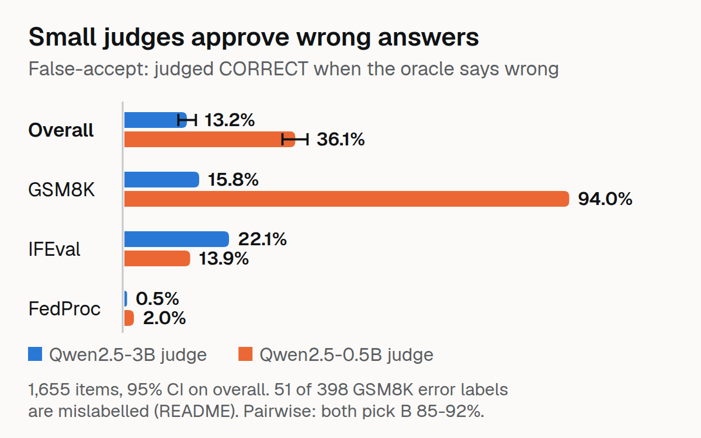

# OracleBench

Grade small open LLM-as-judge setups against deterministic oracles — and ship the harness that makes most judge calls unnecessary.

## Results

**False-accept rate** (judge says CORRECT on oracle-wrong items):

| Judge | Overall | 95% CI | GSM8K | IFEval | FedProc |
|---|---|---|---|---|---|
| Qwen2.5-3B | 13.2% | [11.4%, 15.1%] | 15.8% | 22.1% | 0.5% |
| Qwen2.5-0.5B | 36.1% | [33.4%, 38.7%] | 94.0% | 13.9% | 2.0% |

The 0.5B judge rubber-stamps arithmetic (94% false-accept) while both judges blanket-reject clause citations (0.0% true-accept). Judge quality is task-specific, not general.

**Pairwise judging is broken**: both judges pick answer B 85–92% of the time regardless of correctness. Verbosity padding on the correct answer makes it worse.

**Self-preference: not detected.** Matched comparison (each judge on its own model's wrong answers vs the other model's, `scripts/selfpref_recheck.py`): Qwen-3B judge 20.7% vs 12.3% with the published labels (Fisher p = 0.03), but 9.6% vs 12.3% (p = 0.42) once the 51 mislabelled GSM8K items are excluded, so the apparent effect was label noise; Qwen-0.5B judge 92.6% vs 94.0% (p = 0.56). The two answer sets come from different prompts, so this is suggestive, not proof.

**Checker-first harness** (oracles first, judge only on uncovered):

| Setup | Errors | Judge calls | Judge GPU-s |
|---|---|---|---|
| Harness | 0/1655 (0.0%) | 100 | 15 |
| Judge-only | 429/1655 (25.9%) | 1,655 | 275 |

94.3% of items route to checkers. 16.6× fewer judge calls (1,655 → 100) and ~18× less judge time (275 s → 15 s), at zero error cost on oracle-covered items — because oracles are ground truth where they apply.

### Label noise in the GSM8K "errors"

The natural GSM8K errors come from [FlipGate](https://github.com/raihan-js/flipgate)'s bf16 run, which used a 256-token generation cap and a strict answer extractor. Re-scoring those answers with a more robust extractor finds the correct answer in **51 of the 398** items labelled "oracle-wrong" (all among the 300 natural ones), so some "false accepts" are correct judgments. Excluding those 51:

| Judge | Overall false-accept, as published | Excluding mislabelled | GSM8K, as published | GSM8K, excluding |
|---|---|---|---|---|
| Qwen2.5-3B | 13.2% | 10.5% | 15.8% | 7.2% |
| Qwen2.5-0.5B | 36.1% | 33.4% | 94.0% | 93.4% |

The 3B judge looks better than first reported; the 0.5B judge approves nearly everything either way. The robust extractor is itself a heuristic, so read the two columns as a range. `scripts/label_noise_sensitivity.py` reproduces this.

## Status

Complete: 14 tests, results above, [dataset on Hugging Face](https://huggingface.co/datasets/raihan-js/oraclebench-items). See `AGENTS.md`.

## Limitations (read before citing)

- Judges are ≤3B local models — nothing here carries to frontier judges.
- GSM8K natural-error labels carry scorer noise (see "Label noise" above): report the 10.5-13.2% (3B) and 33.4-36.1% (0.5B) range, not one number.
- Synthetic corruptions are easier to catch than natural errors (2.7% vs 23.8% FA); slices reported separately, always.
- FedProc "0.5% FA" is blanket rejection, not discrimination (0.0% true-accept).

## License

MIT
